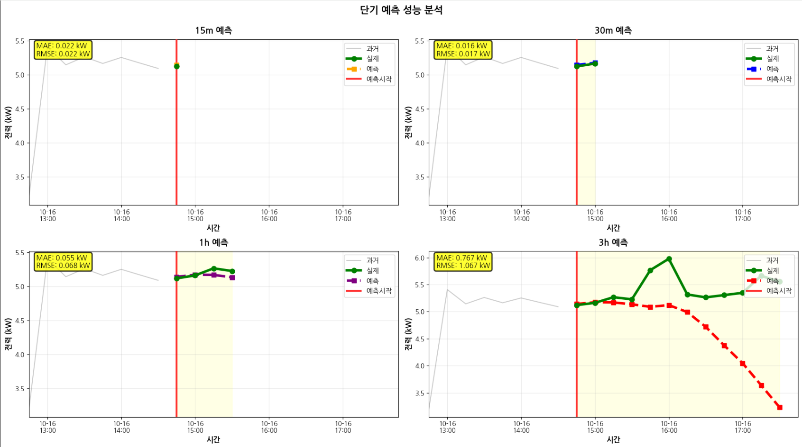

# BEMS 전력 소비 예측 GRU 모델

[](https://pytorch.org/)
[](https://www.python.org/)
[](https://developer.nvidia.com/cuda-toolkit)

BEMS(Building Energy Management System) 전력 데이터를 활용한 시계열 예측 프로젝트입니다. GRU(Gated Recurrent Unit) 모델을 사용하여 15분 단위의 전력 소비를 예측합니다.

## 📊 프로젝트 개요

## 📊 프로젝트 개요

### 배경 및 목적
건물 에너지 관리 시스템(BEMS)에서 전력 소비를 정확히 예측하면:
- ⚡ **에너지 비용 절감**: 피크 시간대 전력 사용 최적화
- 🌱 **탄소 배출 감소**: 효율적인 에너지 관리
- 📊 **운영 효율성 향상**: 사전 예방적 설비 관리

### 핵심 성과
- 📈 **R² Score 0.87**: 전력 소비 변동의 87%를 모델이 설명
- ⚡ **단기 예측 우수**: 15~30분 예측에서 MAE 0.02kW 이하 달성
- 🔧 **체계적 전처리**: 581개 결측치를 3단계 하이브리드 방식으로 복원

### 기술 스택
- **데이터**: 15분 간격의 전력 소비 데이터
- **모델**: PyTorch 기반 3-layer GRU
- **예측**: 과거 96개 시퀀스(24시간) → 다음 15분 예측

## 🎯 담당 역할

본 프로젝트에서 다음 작업을 수행했습니다:

- ✅ **데이터 전처리**: 결측치 처리, 시계열 특성 엔지니어링
- ✅ **GRU 모델 설계 및 구현**: PyTorch 기반 3-layer GRU 아키텍처
- ✅ **설정 파일 관리**: `config.yaml`, `feature_spec.json`, `training_metadata.json` 구조 설계 및 작성

## 📁 프로젝트 구조

```
GRU-main/
├── GRU모델.ipynb              # 데이터 전처리부터 모델 학습까지 전체 파이프라인
├── gru_model_2.pth            # 학습된 모델 가중치
├── config.yaml                # 모델 및 학습 설정
├── feature_spec.json          # 특성 정의 및 전처리 사양
├── training_metadata.json     # 학습 메타데이터
└── README.md                  # 프로젝트 문서
```

## 🔧 주요 기술 스택

### 개발 환경
- Python 3.12.12
- PyTorch 2.8.0
- CUDA 12.5

### 주요 라이브러리
- **데이터 처리**: pandas, numpy
- **모델링**: PyTorch
- **시각화**: matplotlib
- **전처리**: scikit-learn (MinMaxScaler)

## 📈 데이터 전처리

### 1. 결측치 처리
3단계 하이브리드 방식을 적용하여 총 581개의 결측 데이터를 복원했습니다:

| 결측 유형 | 처리 방법 | 데이터 수 |
|---------|---------|---------|
| 단기 결측 | 앞뒤 평균값 | 44개 |
| 중기 결측 | 선형 보간 | 12개 |
| 장기 결측 | 패턴 기반 | 525개 |

### 2. 특성 엔지니어링
총 15개의 특성을 생성했습니다:

**시간적 특성 (Cyclical Encoding)**
- `hour_sin`, `hour_cos`: 시간의 순환적 특성
- `day_of_week_sin`, `day_of_week_cos`: 요일의 순환적 특성
- `is_weekend`, `is_holiday`: 주말/공휴일 이진 특성

**지연 특성 (Lag Features)**
- `power_lag_1`: 15분 전 전력
- `power_lag_4`: 1시간 전 전력
- `power_lag_12`: 3시간 전 전력
- `power_lag_96`: 24시간 전 전력

**차분 특성 (Difference Features)**
- `power_diff`: 1차 차분
- `power_diff_2`: 2차 차분
- `power_diff_4`: 4차 차분
- `power_accel`: 가속도 (2차 차분의 차분)

**통계적 특성**
- `power_std_12`: 3시간 이동 표준편차

### 3. 정규화
- MinMaxScaler를 사용하여 [0, 1] 범위로 정규화
- 입력 특성과 타겟 변수에 별도의 스케일러 적용

## 🧠 모델 아키텍처

### GRU 모델 구조
```python
GRU(
  input_size=15,      # 특성 개수
  hidden_size=128,    # 은닉층 크기
  num_layers=3,       # 레이어 수
  dropout=0.3,        # 드롭아웃 비율
  batch_first=True    # 배치를 첫 번째 차원으로
)
```

### 시퀀스 구조
- **입력 형태**: (batch_size, 96, 15)
  - 96: 시퀀스 길이 (24시간 = 96 × 15분)
  - 15: 특성 개수
- **출력 형태**: (batch_size, 1)
  - 다음 시점(15분 후)의 전력 소비 예측값

## 🎓 학습 설정

### 손실 함수
피크 시간대 예측 성능 향상을 위한 가중 MSE Loss 적용:

```python
WeightedMSELoss(
  peak_weight=2.0,           # 피크 시간 가중치
  normal_weight=1.0,         # 일반 시간 가중치
  threshold_multiplier=2.3   # 피크 판정 기준 (평균의 2.3배)
)
```

### 최적화
- **Optimizer**: Adam (lr=0.001)
- **Scheduler**: ReduceLROnPlateau
  - factor: 0.5
  - patience: 20
  - min_lr: 0.00001
- **Batch Size**: 32
- **Epochs**: 200
- **Device**: CUDA

### 데이터 분할
| 구분 | 기간 | 샘플 수 |
|-----|------|---------|
| 훈련 | 2025-08-22 ~ 2025-09-29 | 3,671 |
| 검증 | 2025-09-29 ~ 2025-10-07 | 786 |
| 테스트 | 2025-10-07 ~ 2025-10-15 | 788 |
| **총합** | | **5,245** |

## 📊 모델 성능

테스트 데이터셋에서의 성능 지표:

| Metric | Value |
|--------|-------|
| MAE | 0.4033 kW |
| RMSE | 0.6071 kW |
| R² Score | 0.8734 |
| MAPE | 23.98% |

### 예측 결과 시각화


**다양한 예측 윈도우 성능 비교**
- **15분 예측**: MAE 0.022 kW, RMSE 0.022 kW (매우 높은 정확도)
- **30분 예측**: MAE 0.016 kW, RMSE 0.017 kW (우수한 단기 예측)
- **1시간 예측**: MAE 0.055 kW, RMSE 0.068 kW (안정적 예측)
- **3시간 예측**: MAE 0.767 kW, RMSE 1.067 kW (장기 예측 도전 과제)
- 
## 💾 설정 파일 설명

### config.yaml
모델 전체 설정을 관리하는 메인 설정 파일입니다:
- 모델 메타정보 (버전, 프레임워크, 작성자)
- 데이터 전처리 방법 및 파라미터
- 모델 아키텍처 하이퍼파라미터
- 학습 설정 (에포크, 배치 사이즈, 옵티마이저)
- 손실 함수 및 스케줄러 설정
- 성능 지표

### feature_spec.json
특성 정의 및 데이터 형상 명세:
- 타겟 변수 및 시퀀스 길이
- 특성 컬럼 리스트 및 유형별 분류
- 전처리 방법 (결측치, 스케일링)
- 입력/출력 데이터 형상

### training_metadata.json
학습 실행 메타데이터:
- 학습 데이터 기간 및 샘플 수
- 하이퍼파라미터 스냅샷
- 프레임워크 버전 정보

## 🚀 사용 방법

### 1. 환경 설정
```bash
pip install torch torchvision torchaudio --index-url https://download.pytorch.org/whl/cu125
pip install pandas numpy scikit-learn matplotlib pyyaml
```

### 2. 학습
```python
# 노트북 파일 참조
jupyter notebook GRU모델.ipynb
```

### 3. 추론
```python
import torch
import pickle

# 모델 로드
model = SimpleGRU(input_size=15, hidden_size=128, num_layers=3, dropout=0.3)
model.load_state_dict(torch.load('gru_model_2.pth'))
model.eval()

# 스케일러 로드
with open('scaler_X.pkl', 'rb') as f:
    scaler_X = pickle.load(f)
with open('scaler_y.pkl', 'rb') as f:
    scaler_y = pickle.load(f)

# 예측
with torch.no_grad():
    # X: (1, 96, 15) 형태의 입력
    X_scaled = scaler_X.transform(X.reshape(-1, 15)).reshape(1, 96, 15)
    X_tensor = torch.FloatTensor(X_scaled)
    pred_scaled = model(X_tensor)
    pred = scaler_y.inverse_transform(pred_scaled.numpy())
```

## 📝 주요 개선 사항

1. **피크 시간대 예측 향상**
   - 가중 손실 함수를 통해 피크 시간의 예측 정확도 개선
   - threshold_multiplier로 피크 시간 동적 판정

2. **풍부한 특성 엔지니어링**
   - 순환 인코딩으로 시간의 주기성 표현
   - 다양한 지연 특성으로 시간적 의존성 포착
   - 차분 및 통계 특성으로 변화율과 변동성 반영

3. **체계적인 결측치 처리**
   - 결측 구간 길이에 따른 적응적 보간 방법 적용
   - 장기 결측에 패턴 기반 복원으로 데이터 품질 향상

4. **재현 가능한 설정 관리**
   - YAML/JSON 기반 설정 파일로 실험 추적 용이
   - 버전 관리 및 하이퍼파라미터 히스토리 관리

## 🔍 향후 개선 방향

- [ ] Attention 메커니즘 추가로 장기 의존성 강화
- [ ] 외부 변수(온도, 습도) 통합
- [ ] 멀티스텝 예측으로 확장
- [ ] 앙상블 모델 적용

## 👤 Author

**정동인 (Dongin Jung)**
- Role: AI Engineer Intern
- Contact: [jde577776@gmail.com/[GitHub 링크](https://github.com/DOrigin1202)]

## 📄 License

이 프로젝트는 [라이선스 유형]에 따라 라이선스가 부여됩니다.

---

⚡ **Built with PyTorch for Smart Energy Management**
